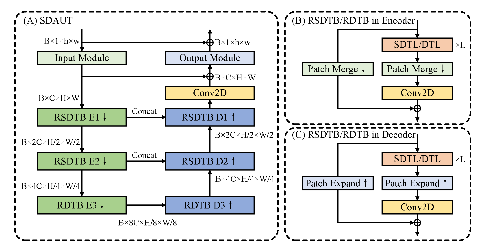
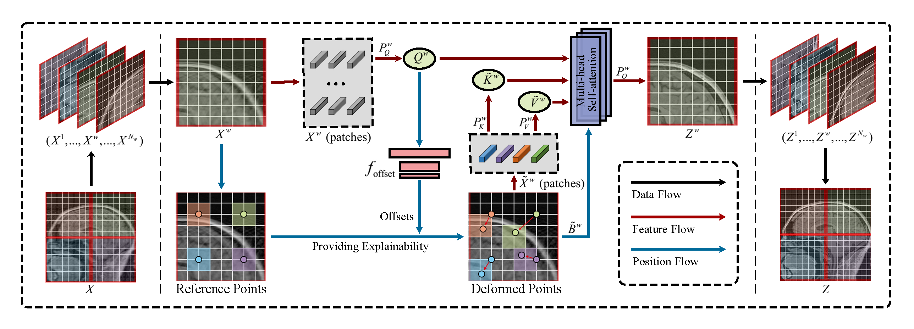

# SDAUT

by Jiahao Huang (j.huang21@imperial.ac.uk)

This is the official implementation of our proposed SDAUT:

Swin Deformable Attention U-Net Transformer (SDAUT) for Explainable Fast MRI

Please cite:

```
@ARTICLE{2022arXiv220702390H,
       author = {{Huang}, Jiahao and {Xing}, Xiaodan and {Gao}, Zhifan and {Yang}, Guang},
        title = "{Swin Deformable Attention U-Net Transformer (SDAUT) for Explainable Fast MRI}",
      journal = {arXiv e-prints},
     keywords = {Computer Science - Computer Vision and Pattern Recognition, Computer Science - Machine Learning, Electrical Engineering and Systems Science - Image and Video Processing},
         year = 2022,
        month = jul,
          eid = {arXiv:2207.02390},
        pages = {arXiv:2207.02390},
archivePrefix = {arXiv},
       eprint = {2207.02390},
 primaryClass = {cs.CV},
       adsurl = {https://ui.adsabs.harvard.edu/abs/2022arXiv220702390H},
      adsnote = {Provided by the SAO/NASA Astrophysics Data System}
}

```

The structure of SDAUT:




Our proposed swin deformable self-attention:




## Requirements

matplotlib==3.3.4

opencv-python==4.5.3.56

Pillow==8.3.2

pytorch-fid==0.2.0

scikit-image==0.17.2

scipy==1.5.4

tensorboardX==2.4

timm==0.4.12

torch==1.9.0

torchvision==0.10.0

## Training and Testing
Use different options (json files) to train different networks.

### Calgary Campinas multi-channel dataset (CC) 

To train SDAUT on CC:

`python main_train_sdaut.py --opt ./options/SDAUT/example/train_sdaut_CCsagnpi_G1D30_kkddkk_offset_ps2_res256.json`

To test SDAUT on CC:

`python main_test_sdaut_CC.py --opt ./options/SDAUT/example/test/test_sdaut_CCsagnpi_G1D30_kkddkk_offset_ps2_res256.json`


This repository is based on:

Swin Transformer for Fast MRI 
([code](https://github.com/ayanglab/SwinMR) and [paper](https://www.sciencedirect.com/science/article/pii/S0925231222004179));

SwinIR: Image Restoration Using Swin Transformer 
([code](https://github.com/JingyunLiang/SwinIR) and [paper](https://openaccess.thecvf.com/content/ICCV2021W/AIM/html/Liang_SwinIR_Image_Restoration_Using_Swin_Transformer_ICCVW_2021_paper.html));

Swin Transformer: Hierarchical Vision Transformer using Shifted Windows
([code](https://github.com/microsoft/Swin-Transformer) and [paper](https://openaccess.thecvf.com/content/ICCV2021/html/Liu_Swin_Transformer_Hierarchical_Vision_Transformer_Using_Shifted_Windows_ICCV_2021_paper.html)).

Vision Transformer with Deformable Attention
([code](https://github.com/LeapLabTHU/DAT) and [paper](h